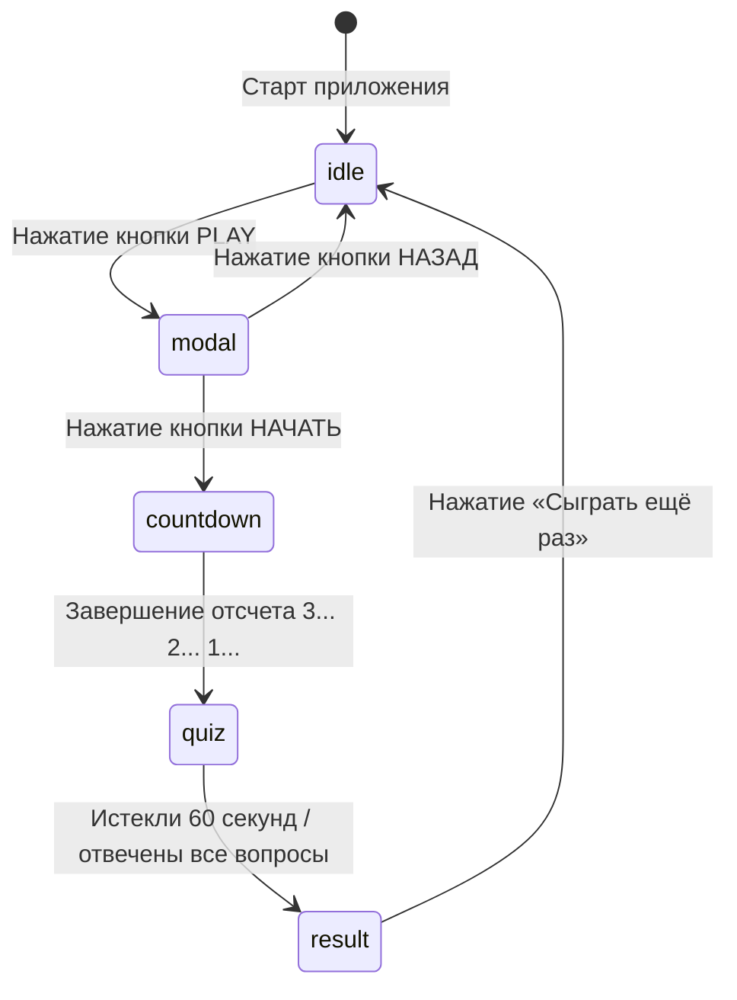

# Архитектура проекта Samsung Galaxy Quiz
### Интерактивный Kiosk-квиз для Samsung Galaxy Z Fold8, Fold8 Ultra и мобильных устройств

---

## 📌 1. Обзор проекта и назначение

Веб- и нативное Android-приложение для интерактивного тестирования гостей на фестивалях и бренд-зонах **Samsung Galaxy**.

- **Целевые устройства**: Samsung Galaxy Z Fold8, Samsung Galaxy Z Fold8 Ultra (в разложенном виде), а также вертикальные смартфоны линейки Galaxy (S23 Ultra, S24 Ultra и др.).
- **Режимы запуска**:
  1. **Нативное Android-приложение (APK)** — работает 100% офлайн без интернета, в полноэкранном киоск-режиме (Immersive Kiosk Mode) со скрытой строкой состояния (батарея, связь, часы).
  2. **Веб-версия (SPA / PWA)** — развёрнута на Vercel (`https://samsung-gilt.vercel.app`), полностью адаптивна под любые экраны и мобильные браузеры (включая Яндекс.Браузер со специфическими плавающими панелями).

---

## 🛠 2. Стек технологий

| Технология | Версия | Назначение |
| :--- | :--- | :--- |
| **React** | `19.2.8` | Декларативный UI-фреймворк |
| **TypeScript** | `~6.0.2` | Строгая типизация данных, логики и событий |
| **Vite** | `8.3.0` | Молниеносный бандлер и dev-сервер |
| **Tailwind CSS** | `v4.3.3` | Современная utility-first стилизация (`@tailwindcss/vite`) |
| **Capacitor** | `8.5.2` | Кроссплатформенный нативный мост для Android |
| **Android SDK / Gradle** | `8.14.3` / `AGP 8.13.0` | Нативная сборка APK для Android 8.0 – 15+ |
| **canvas-confetti** | `1.9.4` | Анимация конфетти на экране результатов |
| **lucide-react** | `1.47.0` | Векторные SVG-иконки |
| **Unbounded Font** | Variable WOFF2 | Геометрический фестивальный акцидентный шрифт (встроен локально) |

---

## 📂 3. Структура файловой системы

```text
samsung/
├── android/                        # Нативный проект Android Studio (Capacitor)
│   ├── app/
│   │   ├── src/main/
│   │   │   ├── assets/public/      # Скомпилированный веб-билд внутри APK
│   │   │   ├── java/.../MainActivity.java # Точка входа Android (Immersive Mode)
│   │   │   └── res/values/styles.xml      # Стили полноэкранного режима
│   │   └── build.gradle
│   ├── local.properties            # Путь к локальному Android SDK
│   └── gradlew.bat                 # Gradle-враппер для сборки APK
├── public/
│   ├── fonts/                      # 100% автономные локальные WOFF2-шрифты
│   │   ├── unbounded-cyrillic.woff2
│   │   ├── unbounded-cyrillic-ext.woff2
│   │   ├── unbounded-latin.woff2
│   │   └── unbounded-latin-ext.woff2
│   ├── manifest.webmanifest        # Манифест PWA
│   └── sw.js                       # Service Worker
├── src/
│   ├── assets/                     # Статические ресурсы
│   ├── data/
│   │   └── questions.json          # База из 170 валидированных вопросов
│   ├── types/
│   │   └── quiz.ts                 # TypeScript-типы сессий, логов и вопросов
│   ├── utils/
│   │   └── sessionManager.ts       # Математический алгоритм неповторения сессий
│   ├── components/
│   │   ├── WelcomeScreen.tsx       # Стартовый экран (КВИЗ + PLAY)
│   │   ├── PromptModal.tsx         # Всплывающее окно («НАЧАТЬ» / «НАЗАД»)
│   │   ├── CountdownOverlay.tsx    # Обратный отсчет 3... 2... 1...
│   │   ├── QuizScreen.tsx          # 60-секундный раунд вопросов
│   │   ├── ResultScreen.tsx        # Финальный экран с очками и конфетти
│   │   └── KioskHeader.tsx         # Вспомогательные элементы
│   ├── App.tsx                     # Главная машина состояний (State Machine)
│   ├── main.tsx                    # Точка входа React
│   └── index.css                   # Глобальные стили (Tailwind v4 + straight corners)
├── capacitor.config.ts             # Конфигурация нативного приложения Capacitor
├── index.html                      # HTML-контейнер SPA
├── package.json                    # Зависимости и скрипты сборки
├── vercel.json                     # Конфигурация роутинга и MIME-типов для Vercel
├── vite.config.ts                  # Конфигурация сборщика Vite
├── Samsung_Galaxy_Quiz.apk         # Готовый нативный установочный файл APK
└── ARCHITECTURE.md                 # Документация архитектуры (этот файл)
```

---

## 🧮 4. Архитектура данных и банк вопросов

### 4.1. Структура `questions.json`
База данных содержит **170 уникальных вопросов**, извлеченных и нормализованных из исходной таблицы `Samsung_NSW26_вопросы для квиза.xlsx`.

```typescript
export interface QuizQuestion {
  id: number;           // Уникальный ID (1..170)
  question: string;     // Текст вопроса
  options: string[];    // Ровно 3 варианта ответа
  correctIndex: number; // Индекс правильного ответа в исходном массиве (0..2)
  correctAnswer: string;// Текст правильного ответа
}
```

### 4.2. Очистка и валидация данных
- **Устранены конфликты символов**: символы латиницы A, B, C в ответах нормализованы с кириллицей.
- **Очистка чисел от артефактов Excel**: все числовые значения (года, даты, штуки, например `2026.0`, `2020.0`, `150.0`) приведены к целочисленному виду (`2026`, `2020`, `150`).
- **Перемешивание вариантов (Fisher-Yates)**: при выдаче вопроса в `QuizScreen.tsx` варианты ответов перемешиваются в случайном порядке, но флаг `isCorrect` строго привязан к верному варианту. Это исключает запоминание позиций кнопок.

---

## 🧠 5. Алгоритмический модуль сессий (`sessionManager.ts`)

На фестивалях пользователи часто играют несколько раз подряд. Алгоритм предотвращает появление одних и тех же вопросов:

### Математические правила алгоритма:
1. **Внутри сессии**: 0 дубликатов.
2. **Сессия $n+1$**: строго **0 вопросов** из сессии $n$.
   $$\text{Intersection}(S_{n+1}, S_n) = \emptyset$$
3. **Сессия $n+2$**: **не более 2 вопросов** из сессии $n$.
   $$|S_{n+2} \cap S_n| \le 2$$

### Реализация:
- Сохранение истории последних двух сессий в `localStorage` по ключу `samsung_quiz_session_history_v1`.
- Фильтрация общего пула вопросов (170 шт.) с приоритетным выбором из пула «свежих» вопросов.
- Модуль покрыт стресс-тестом (`scripts/test_session_logic.js`), доказавшим 0 нарушений правил на дистанции 100 сессий подряд.

---

## 🔄 6. Машина состояний интерфейса (`App.tsx`)

В приложении реализован линейный и надежный конечный автомат состояний:



### Состояния:
1. **`idle` (`WelcomeScreen.tsx`)**:
   - Чистый экран с крупной надписью **КВИЗ** и кнопкой **PLAY**.
2. **`modal` (`PromptModal.tsx`)**:
   - Модальное окно с инструкцией: *«Ответьте на максимальное количество вопросов за 60 секунд. Если готовы, жмите "НАЧАТЬ"»*.
   - Кнопки **«НАЧАТЬ»** и **«НАЗАД»** выполнены в строго одинаковом размере и шрифте.
3. **`countdown` (`CountdownOverlay.tsx`)**:
   - Полноэкранный динамический обратный отсчет: **3... 2... 1... Вперёд!**
4. **`quiz` (`QuizScreen.tsx`)**:
   - 60-секундный таймер.
   - Верхний HUD: **ВОПРОС X**, таймер **XX СЕК** и счетчик **ПРАВИЛЬНО: X** (все три блока оформлены одним крупным кеглем в шрифте Unbounded, «СЕК» пододвинуто вплотную к цифрам).
   - Линейный прогресс-бар оставшегося времени.
   - Карточка вопроса с легким фоном `bg-slate-50` и рамкой.
   - Три крупные вертикальные кнопки ответов A, B, C с тактильным откликом при выборе (зеленый при правильном, красный при ошибке).
5. **`result` (`ResultScreen.tsx`)**:
   - Надпись «ВРЕМЯ ВЫШЛО».
   - Крупнейший счетчик правильных ответов и общее число попыток.
   - Запуск конфетти через `canvas-confetti`.
   - Кнопка «СЫГРАТЬ ЕЩЁ РАЗ».

---

## 🎨 7. Дизайн-система и геометрия

- **Цветовая палитра**:
  - Фон: `#ffffff` (чистый белый).
  - Акцентный/текстовый: `#0f172a` (глубокий сланцевый графит / черный).
  - Успех: `emerald-600` (зеленый).
  - Ошибка: `rose-600` (красный).
- **Прямые углы 90°**:
  - На уровне `src/index.css` глобально закреплено: `*, *:before, *:after { border-radius: 0px !important; }`.
  - Все кнопки, рамки, карточки и бейджи имеют строгую форму без скруглений.
- **Текстовый регистр**:
  - Весь текст в приложении принудительно переведен в верхний регистр: `text-transform: uppercase`.
- **Шрифт**:
  - Основной шрифт — фестивальный геометрический **Unbounded**.
  - Файлы шрифта `.woff2` встроены локально в `public/fonts/` через `@font-face` в `index.css`.

---

## 📱 8. Адаптивность и кросс-девайсная верстка

### Разделение логики под экраны:
1. **Samsung Galaxy Z Fold8 / Fold8 Ultra (развернутый экран)**:
   - CSS-ширина $\ge 768$px (брейкпоинты `md:` и `lg:`).
   - Элементы занимают всю ширину (`w-full`) с пропорциональными отступами (`p-10 lg:p-14`).
   - Кнопки ответов имеют комфортную увеличенную высоту (`min-h-[90px] md:min-h-[110px] lg:min-h-[125px]`).
   - Свободное распределение `md:justify-between`.
2. **Вертикальные смартфоны (Samsung Galaxy S23/S24 Ultra, iPhone)**:
   - CSS-ширина $< 768$px (базовый брейкпоинт).
   - Выравнивание `justify-start` с компактными отступами между карточкой и кнопками, предотвращающее появление паразитных пустот.
   - Безопасный отступ снизу `pb-24`, чтобы контент гарантированно не перекрывался плавающими панелями мобильных браузеров (адресная строка и навигация Яндекс.Браузера).
   - Включен скролл `overflow-y-auto` с `min-h-0` и `touch-action: pan-y`, позволяющий прокручивать страницу в случае нестандартного разрешения.

---

## 🤖 9. Нативная архитектура Android (Capacitor)

### 9.1. Конфигурация (`capacitor.config.ts`)
```typescript
const config: CapacitorConfig = {
  appId: 'com.samsung.nsw26.quiz',
  appName: 'Samsung Galaxy Quiz',
  webDir: 'dist',
  server: {
    androidScheme: 'https'
  }
};
```

### 9.2. Immersive Kiosk Mode (`MainActivity.java`)
Для устранения строки состояния (Status Bar с зарядом батареи, часами, Wi-Fi и сотовой связью) в `MainActivity.java` встроен контроллер системных окон:
- `WindowInsetsControllerCompat.hide(WindowInsetsCompat.Type.statusBars())` — скрывает системный статус-бар.
- `BEHAVIOR_SHOW_TRANSIENT_BARS_BY_SWIPE` — при случайном свайпе сверху шторка появляется прозрачной и моментально скрывается обратно.
- `LAYOUT_IN_DISPLAY_CUTOUT_MODE_SHORT_EDGES` — разрешает отрисовку интерфейса вокруг выреза камеры (Punch Hole), задействуя 100% матрицы экрана Samsung.

---

## 💻 10. Руководство для работы в Antigravity 2.0 на другом ПК

При переносе проекта на другой компьютер:

### Шаг 1: Системные требования
- **Node.js**: `v18.0.0` или выше (рекомендуется `v20+` LTS).
- **JDK**: Java 17 или Java 21 (например, встроенный JDK из Android Studio: `jbr`).
- **Android Studio** (опционально, если потребуется сборка APK).

### Шаг 2: Установка зависимостей
Распакуйте архив и в терминале выполните:
```bash
npm install
```

### Шаг 3: Основные команды разработки
| Команда | Описание |
| :--- | :--- |
| `npm run dev` | Запуск локального сервера разработки Vite (`http://localhost:5173`) |
| `npm run build` | Компиляция TypeScript и создание продакшн-сборки в папке `dist/` |
| `npm run preview` | Локальный просмотр скомпилированной сборки |
| `npm run cap:sync` | Сборка веба и синхронизация ассетов в нативную папку `android/` |
| `npm run cap:open` | Открытие нативного проекта в Android Studio |

### Шаг 4: Сборка нативного APK из терминала
```powershell
# Указать путь к JDK 17/21 (например, от Android Studio)
$env:JAVA_HOME="C:\Program Files\Android\Android Studio\jbr"

# Собрать APK через Gradle
cd android
.\gradlew.bat assembleDebug

# Готовый APK будет расположен по пути:
# android\app\build\outputs\apk\debug\app-debug.apk
```

### Шаг 5: Деплой на Vercel
```bash
# Развертывание в продакшн
npx vercel --prod --yes
```

---

*Документ подготовлен для команды разработки Samsung Galaxy Quiz.*
